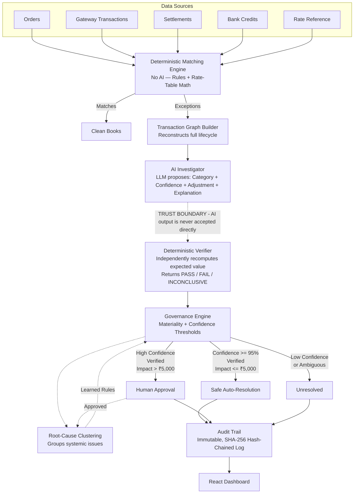

# FinEx Controller

> **Your reconciliation system tells you what broke. FinEx tells you why, proves it, and tells you what to do next.**

*A Razorpay AI Buildathon Submission*

---

## 🛑 The Problem

Modern reconciliation systems and payment gateways do an excellent job of matching primary keys. But when a transaction fails to reconcile (an "exception"), traditional systems just dump the row into a spreadsheet for an operations team to manually investigate. 

Worse, naive "AI wrappers" built to solve this problem often fail in production because they:
1. **Hallucinate Root Causes**: They invent arbitrary categories (like `DATA_INCONSISTENCY`) that don't match the business's taxonomy.
2. **Lack Mathematical Proof**: They guess amounts without deterministic verification.
3. **Have No Governance**: They auto-resolve exceptions based purely on "AI confidence," leading to disastrous financial write-offs.
4. **Ignore Systemic Issues**: They treat 35 identical rate-table errors as 35 separate tickets, instead of one systemic configuration bug.

## 💡 The FinEx Solution

FinEx is a **Governance-by-Construction AI Controller**. It sits on top of standard matching engines and investigates the exceptions using a rigorous, multi-layered architecture that treats LLMs as *investigators*, not *authorities*.

### 🏗️ Exception Intelligence Architecture



## 🧠 Deep Engineering Highlights

We didn't just plug data into Gemini. We engineered strict, production-ready constraints to ensure the system is safe, deterministic, and scalable.

### 1. Strict Taxonomy Enforcement
We used strict Pydantic `Literal` schemas to force the LLM to select from exactly 9 true root-cause categories (e.g., `FEE_SCHEDULE_DRIFT`, `PARTIAL_PAYMENT`). This structurally prevents the AI from hallucinating unmappable categories, ensuring downstream analytics and clustering remain perfectly clean.

### 2. Governance-by-Construction (Materiality Limits)
LLMs cannot be trusted with blank checks. Even if the AI is 100% confident and the user manually "approves" a resolution rule, our `Governance Engine` explicitly caps all learned rules at a strict `GLOBAL_MATERIALITY_LIMIT` (e.g., ₹5,000). The code mathematically prevents any auto-resolution above this ceiling, structurally mitigating edge-case financial risk.

### 3. The Deterministic Trust Boundary
AI outputs are never directly applied to the ledger. The LLM acts as a detective proposing a hypothesis (e.g., *"The gateway charged a 2% fee instead of 1.5%"*). This hypothesis must pass a **Deterministic Verifier** which recalculates the exact ledger math based on raw rate tables. Only if `Observed + AI_Adjustment == Expected` does the hypothesis proceed to governance.

### 4. API Quota Safety & Evaluation Tooling
To iterate reliably without burning through rate limits, we built:
- **Category-Stratified Sampling** (`sample_investigation.py`): Picks a mathematically representative slice of exceptions across all categories so we can evaluate model performance on just 15 API calls.
- **Robust 429/503 Handling**: Exponential backoff and jitter logic for the Gemini API.
- **Offline Diagnostics** (`diagnose_mismatches.py`): A script that scores AI predictions against ground-truth datasets, explicitly flagging schema violations or hallucinated logic without hitting live APIs.

### 5. Systemic Clustering
Instead of overwhelming operations teams with 35 separate tickets for a single rate-table misconfiguration, FinEx clusters exceptions sharing the same AI-identified root cause into a **single actionable cluster**. 

---

## 📊 Measured Evaluation Metrics

FinEx was tested on a synthetic dataset of 260+ orders. The following are the **measured synthetic-data results under Mock/LLM-provider conditions**:

- **Total Exceptions Investigated:** 99
- **Total Financial Impact:** ₹416,803
- **Causal Correctness:** 85.8586%
- **Mathematical Correctness:** 94.9495%
- **Resolution Correctness:** 53.5354%
- **False Auto-Resolution Rate:** 0%
- **Books Confidence:** 62.9% *(Value-weighted metric counting only safely resolved or human-approved exceptions)*

## 🖥️ The UI

The FinEx frontend is built with React + Vite + Tailwind CSS.

- **Batch Dashboard:** High-level metrics, Books Confidence, and aggregated Root Cause clusters.
- **Root-Cause Cluster:** A grouped view of all transactions suffering from the same systemic failure.
- **Exception Investigation:** Deep dive into a single exception showcasing the exact variance, AI hypothesis, strict deterministic mathematical verification, the contextual transaction graph, and the required governance action.

---

## 🛠️ How to Run Locally

### Prerequisites
- Python 3.10+
- Node.js & npm

### 1. Backend Setup
```bash
# Install dependencies
pip install fastapi uvicorn pandas pydantic networkx google-genai pytest

# 1. Generate the data and run the deterministic matching engine
python -m scripts.generate_data
python -m backend.ingest
python -m backend.reconciliation

# 2. Run the AI Investigation (Mock Mode)
python -m backend.investigation_loop
python -m backend.clustering
python -m backend.evaluation

# To run the REAL Gemini pipeline (Quota-Safe Sample):
# export GEMINI_API_KEY="your_api_key"
# python scripts/sample_investigation.py --n-per-category 2
# python -m backend.investigation_loop --exception-ids-file data/sample_selection.json

# 3. Start the FastAPI Server
python -m uvicorn backend.main:app --host 0.0.0.0 --port 8000
```

### 2. Frontend Setup
```bash
cd frontend
npm install
npm run dev
```

Visit `http://localhost:5173` to view the Controller dashboard.
